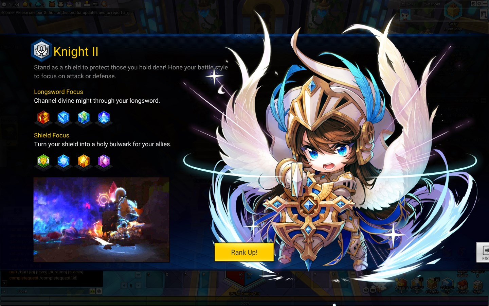

# changejob.xml

Information displayed upon previewing job advancement (to Rank II).

| element | explanation |
|-|-|
| [subJobCode](/data/xml/commonkeywords##sub-job-codes) | Determines which information to display to the player depending upon their SubJobCode found in one the entries |
| changeSubJobCode | Displays which job the player would be advancing to |
| movie | Displays the usm clip of the job the player would be advancing to |
| desc | String of the overall description of the job advancement. The value here points to **/string/stringchangejobdesc.xml** |
| skilldesc1 | String of the job advancement first focus/tree a player can select. The value here points to **/string/stringchangejobdesc.xml** | 
| skillID1 | Skill IDs to display as a preview for the first focus/tree.
| skilldesc2 | String of the job advancement second focus/tree a player can select. The value here points to **/string/stringchangejobdesc.xml**
| skillID2 | Skill IDs to display as a preview for the second focus/tree.
| startquestid | When the player presses "Rank Up!" to proceed with the job advancement, this quest is triggered and displayed to the user to begin.
| endquestid | If the player has completed this quest ID, the rank up button no longer shows up to the user. Handled by the client |