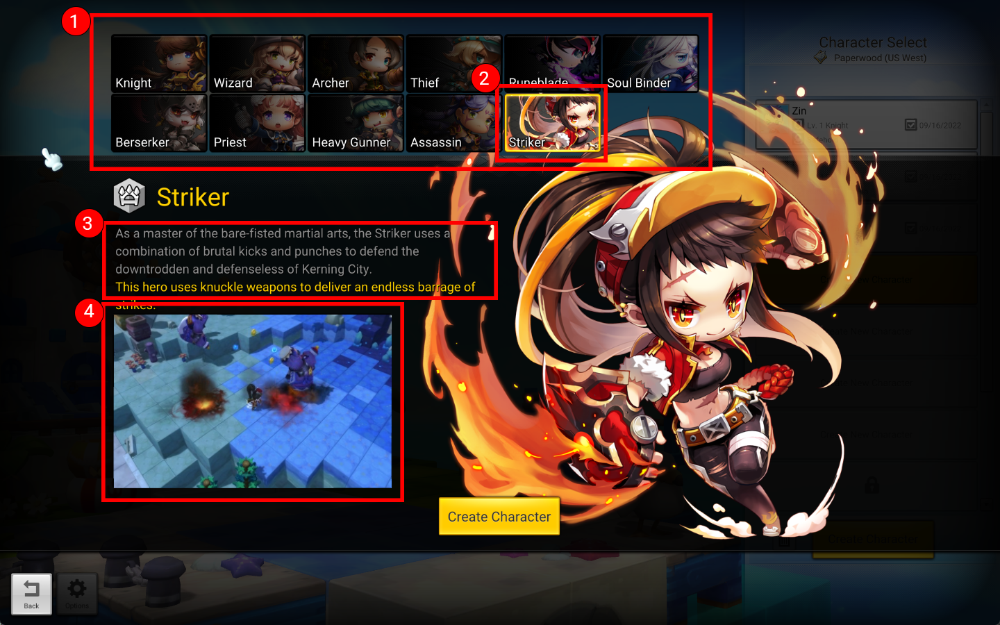

# charactercreateselect.xml

This determines to the client what classes are able to be selected and displayed upon character creation screen.

## Group Name - Data

Each list here determines the data to show of a specific job.

| element | explanation                                                                                               |
|---------|-----------------------------------------------------------------------------------------------------------|
| jobCode | job ID                                                                                                    |
| movie   | Path of the movie that previews the class (**4**).                                                             |
| descKey | Description of the job displayed (**3**). The key points to the id in /string/stringcharactercreateselect.xml |

## Group Name - Display

Each list here determines how the data is laid out for the user.

| element | explanation |
|---------|-------------|
|order    | jobCodes listed, comma separated in a specific order to display (**1**).|
|disableJobCode| Still allows to display the job to the user but unable to be created. The job selection button becomes grayed out.|
|selectJobCode | The default job once the user opens up the character selection screen. Often used to promote a new class (**2**).|
|randomSelectJobCode| A comma separated list to pick one of the random jobs within the list as the highlighted class.|