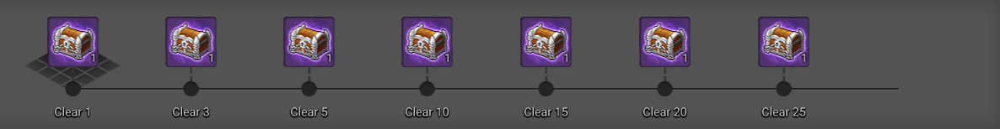

# dungeonconfig.xml

Dungeonconfig configures:
- all possible ranks, score requirements and max score a group/rankTableID can have
- settings for reverse raid
- settings for weekly rewards

## DungeonConfig/MissionRank
Each group can have the following attributes:

| Attribute | Description |
| - | - |
id | Id for differentiating each group, also used in [rankTableID in dungeonroom](/data/xml/table/dungeonroom)
desc | String description of the group, for helping recognizing them
maxScore | Maximum score obtainable

As well as 1 to 5 `v` child elements, each being a rank, with the attribute score defining the score needed to reach that rank. 
The **first** defined `v` will always be rank **C**, the **second** rank **B**, the **third** rank **A**, the **fourth** rank **S**, and the **fifth** rank **S+**.

## ReverseRaidConfig
Not much is known about it. Has the following attributes:

| Attribute | Description |
| - | - |
| startDate | YYYY-MM-DD date |
| periodDays | Seen in the wild only as 7

As well as the child element `v`, containing the dungeon id of the current active reverse raid.

## UnitedWeeklyReward
Contains multiple `v` elements, one for each weekly reward, with the following attributes:

| Attribute | Description |
| - | - |
| rewardCount | Amount of runs complete\* needed to get the reward \*In vanilla, this refers to the run count of dungeon 1006
| rewardID | rewardID, as seen in table [rewardcontent](/data/xml/table/rewardcontent)
| uiPosX | X position of the reward in the gauge of the Dungeon Reward UI. Attempting to position a reward too far off or behind will simply cut it off the UI. Check the gfx uidungeonpopuprewarddialog for a clear view of the gauge's range.
| uiShowBg | Bool. If 1, will turn on the diamond background under the reward.

> Example of a reward with enabled uiShowBg and a reward whose uiPosX was too big.