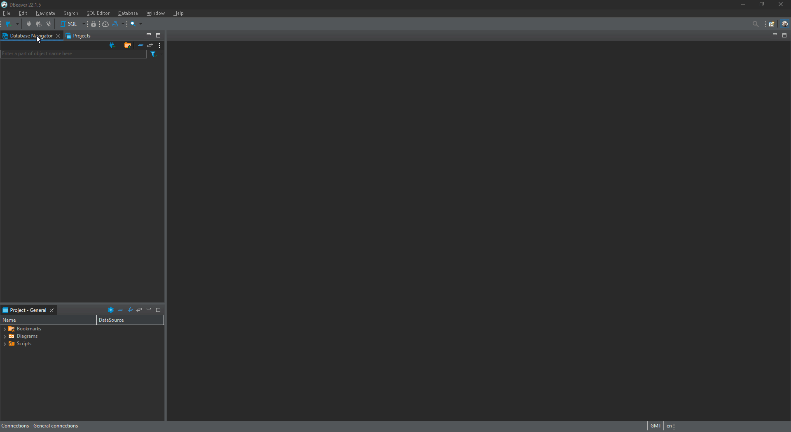

# Database Setup

## Installing MySQL

### MySQL Installer

1. Download and open the MySQL Installer.

2. Select the **Server Only** option and click next, then click execute.

3. You can keep clicking next until **Accounts and Roles** step of `Configuration`, make sure to add a password and remember it, you will need it later. You can ignore the add user option.

4. Keep clicking next and finish the setup.


### Docker

Alternatively, you can run your MySQL server inside a Docker container.

1. Download and install [Docker](https://www.docker.com/products/docker-desktop).

2. Create a file named `docker-compose.yml` in the root of your folder.

    ```yml
    version: "3.9"

    services:
        mysql:
            container_name: mysql
            image: mysql
            restart: always
            build:
                args:
                    DATABASE_USERNAME: ${DATABASE_USERNAME}
                    DATABASE_PASSWORD: ${DATABASE_PASSWORD}
            environment:
                MYSQL_ROOT_PASSWORD: ${DATABASE_PASSWORD}
            volumes:
                - ./data:/var/lib/mysql
                - ./logs:/var/log/mysql
            ports:
                - ${PORT}:${PORT}
            expose:
                - "${PORT}"
    ```

3. Create a file named `.env` in the root of your folder.

    ```sh
    PORT=3306

    DATABASE_HOST=mysql
    DATABASE_USERNAME=root
    DATABASE_PASSWORD=
    ```

4. Run `docker compose up` to start the container. The Docker images will be fetched and container built when run for the first time.

5. Run `docker ps` to confirm that the container is running.

## Optional (Recommended)

### Database GUI

Download a compatible database GUI tool. This will help you delete your database (DROP) as server updates might require you to do this. Also, you can view or edit the server data in the database.

A tested and recommended tool is [DBeaver](https://dbeaver.io/download/).

#### DBeaver

1. Open DBeaver, click on the 'New Database Connection' icon on the top left.
2. Select MySQL and click next.
3. Add the database (Maple2DB), username and password then click finish.
   


#### Visual Studio Code

1. Download the Visual Studio Code extension `MySQL` by `cweijan`.

2. Add a new connection to the chosen compatible SQL database previously installed, in `Visual Studio Code` this can be done by clicking the icon called `Database` on the left side, then click the plus icon on the top of the side panel.

3. Add database, username and password then click finish.
